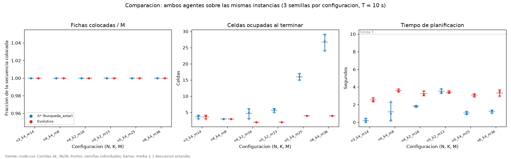
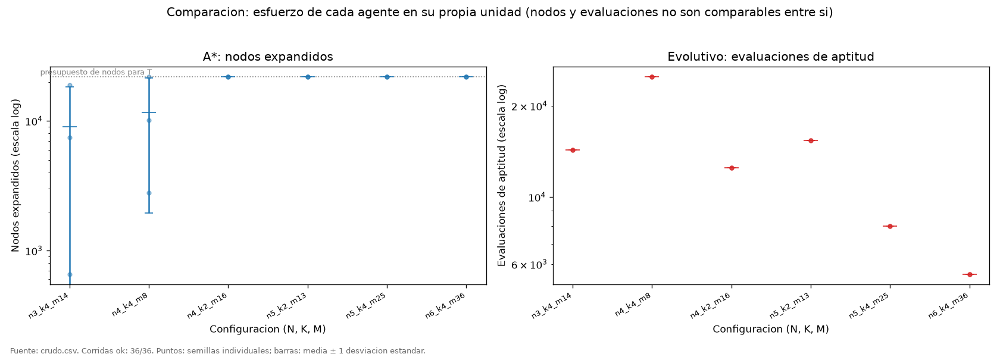
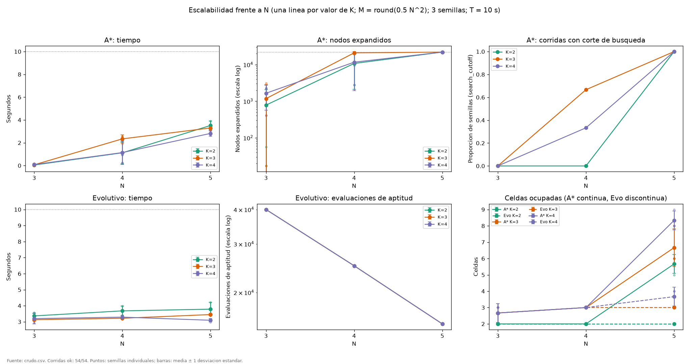
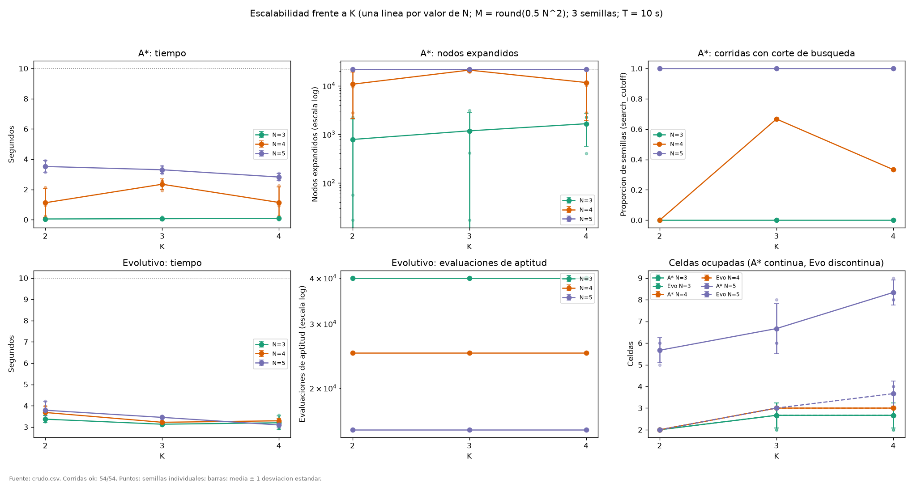

# Informe - Agentes de busqueda y evolutivos para TileUp

Tarea Corta 1 - Inteligencia Artificial (IC-6200) - Instituto Tecnologico de
Costa Rica.

Este documento contiene por ahora la **parte experimental** del informe:
metodologia, comparacion experimental y estudio de escalabilidad (Etapa C). La
formulacion completa de ambos agentes, que corresponde a la Etapa D, esta
documentada en el `README.md` y se incorporara aqui.

Todas las cifras provienen de los CSV formales
`resultados/experimentos/comparacion/crudo.csv` y
`resultados/experimentos/escalabilidad/crudo.csv`, resumidas en los
`resumen.csv` de cada carpeta. En cada seccion se separan los **hechos
medidos** de su **interpretacion**.

## 1. Metodologia

### 1.1 Que exige el enunciado y que decidimos nosotros

| Elemento | Origen |
|---|---|
| Ambos agentes sobre el mismo conjunto de instancias | Enunciado |
| Al menos 6 configuraciones de N, K y M, con al menos 3 semillas cada una | Enunciado |
| Fichas colocadas, celdas ocupadas, tiempo y esfuerzo, con dispersion entre semillas | Enunciado |
| Escalabilidad: al menos 3 valores de N y 3 de K, 3 semillas, grafica de tendencia | Enunciado (grupos de tres) |
| Limite de tiempo `T = 10 s` comun a todas las corridas | Decision nuestra, tras el piloto |
| Semillas pareadas `s = 1, 2, 3` | Decision nuestra |
| Densidad `rho = M / N^2` para fijar M | Decision nuestra |
| Las seis configuraciones de la comparacion | Decision nuestra, tras el piloto |
| Presupuestos deterministas de trabajo de los agentes | Decision nuestra (ver 1.4) |

### 1.2 Instancias y semillas

Todas las instancias las produce el generador del proyecto
(`python main.py generar`). Son resolubles por construccion: el generador juega
una partida legal completa mientras inventa la secuencia.

Las semillas son **pareadas**. Para cada configuracion y cada `s` en {1, 2, 3},
la semilla `s` genera la instancia (`instance_seed`) y esa misma `s` se entrega
al agente (`agent_seed`). Los dos agentes corren sobre **el mismo archivo** de
instancia. En los CSV ambas semillas se registran en columnas separadas.

### 1.3 Metricas

| Columna | Significado |
|---|---|
| `tiles_placed` | Fichas colocadas. Primer criterio del concurso. |
| `occupied_cells` | Celdas ocupadas al terminar. Segundo criterio del concurso. |
| `elapsed_s` | Tiempo de planificacion del agente, en segundos. Tercer criterio. |
| `effort` | Nodos expandidos (A*) o evaluaciones de aptitud (evolutivo). **Son unidades distintas y no se comparan entre si.** |
| `complete` | La solucion final consumio la secuencia completa. |
| `search_cutoff` | Solo A*: la busqueda se detuvo sin alcanzar la meta y la partida se completo con la politica avida. |
| `clock_safeguard` | El reloj de salvaguarda detuvo al agente antes de agotar su presupuesto (ver 1.4). |

`complete = True` y `search_cutoff = True` no se contradicen: A* puede dejar de
alcanzar la meta durante la busqueda y aun asi entregar una solucion que
consume toda la secuencia, gracias al completado posterior.

### 1.4 Criterio de paro, limite de tiempo y determinismo

El enunciado exige a la vez respetar el limite de tiempo y que la misma entrada
produzca la misma solucion. Una primera version detenia a los agentes por
reloj, y eso hizo que A* entregara soluciones distintas para entradas identicas
en sesiones distintas. Por eso ambos agentes se detienen ahora por un
presupuesto de trabajo que depende solo de la entrada, y el reloj queda como
salvaguarda:

| Agente | Presupuesto con `T = 10 s` | Salvaguarda |
|---|---|---|
| `busqueda_astar` | 22000 nodos expandidos | 85 % de `T` |
| `evolutivo` | `floor(200000 / M)` evaluaciones de aptitud | 98 % de `T` |

El procedimiento con que se fijaron las constantes esta en el `README.md`,
seccion *Criterio de paro y determinismo*. Una corrida solo se considera
reproducible si `clock_safeguard = False`.

### 1.5 Validez de las corridas

Cada corrida paso por el validador independiente (`main.py validar`). Una
corrida cuenta como valida solo si el validador acepta la solucion y ademas las
fichas colocadas, celdas ocupadas y ficha mayor que informo el agente coinciden
con las que reproduce el validador.

| Bateria | Corridas | `status = ok` | Validadas | `clock_safeguard = False` | Revalidacion posterior |
|---|---|---|---|---|---|
| Comparacion | 36 | 36 | 36 | 36 | 36/36 |
| Escalabilidad | 54 | 54 | 54 | 54 | 54/54 |

Ninguna corrida excedio el limite. El mayor uso de `T` fue del 38 % en la
comparacion y del 42 % en la escalabilidad.

### 1.6 Entorno

Commit `f0be0f8`, Python 3.14.7, Windows 11, procesador Intel64 Family 6 Model
183, 32 nucleos logicos. Corridas secuenciales, sin paralelismo, el
2026-09-30. Los metadatos completos estan en `metadatos.json` de cada bateria.

## 2. Comparacion experimental

### 2.1 Configuraciones

Seis configuraciones elegidas con el piloto (`resultados/experimentos/piloto/`)
para cubrir los dos regimenes de A*: alcanzar la meta antes de agotar su
presupuesto, y agotarlo y recurrir al completado.

| Config | N | K | M | rho |
|---|---|---|---|---|
| n3_k4_m14 | 3 | 4 | 14 | 1.56 |
| n4_k4_m8 | 4 | 4 | 8 | 0.5 |
| n4_k2_m16 | 4 | 2 | 16 | 1 |
| n5_k2_m13 | 5 | 2 | 13 | 0.52 |
| n5_k4_m25 | 5 | 4 | 25 | 1 |
| n6_k4_m36 | 6 | 4 | 36 | 1 |

Son 6 configuraciones × 3 semillas × 2 agentes = 36 corridas.

### 2.2 Resultados

Cada celda muestra media ± desviacion estandar muestral [minimo–maximo] sobre
las tres semillas.

| Config | Agente | ok | Corte de busqueda | Colocadas | Ocupadas | Tiempo (s) | Esfuerzo |
|---|---|---|---|---|---|---|---|
| n3_k4_m14 | A* | 3/3 | 0/3 | 14 ± 0 [14–14] | 3.67 ± 0.58 [3–4] | 0.22 ± 0.21 [0.02–0.44] | 9018 ± 9231 [656–18923] nodos |
| n3_k4_m14 | Evolutivo | 3/3 | — | 14 ± 0 [14–14] | 3.67 ± 0.58 [3–4] | 2.53 ± 0.22 [2.36–2.78] | 14285 ± 0 [14285–14285] evaluaciones |
| n4_k4_m8 | A* | 3/3 | 1/3 | 8 ± 0 [8–8] | 3 ± 0 [3–3] | 1.19 ± 1.06 [0.27–2.35] | 11647 ± 9695 [2781–22000] nodos |
| n4_k4_m8 | Evolutivo | 3/3 | — | 8 ± 0 [8–8] | 3 ± 0 [3–3] | 3.60 ± 0.16 [3.47–3.78] | 25000 ± 0 [25000–25000] evaluaciones |
| n4_k2_m16 | A* | 3/3 | 3/3 | 16 ± 0 [16–16] | 4.67 ± 1.53 [3–6] | 1.81 ± 0.09 [1.72–1.89] | 22000 ± 0 [22000–22000] nodos |
| n4_k2_m16 | Evolutivo | 3/3 | — | 16 ± 0 [16–16] | 2 ± 0 [2–2] | 3.25 ± 0.27 [3.09–3.56] | 12500 ± 0 [12500–12500] evaluaciones |
| n5_k2_m13 | A* | 3/3 | 3/3 | 13 ± 0 [13–13] | 5.67 ± 0.58 [5–6] | 3.52 ± 0.24 [3.32–3.79] | 22000 ± 0 [22000–22000] nodos |
| n5_k2_m13 | Evolutivo | 3/3 | — | 13 ± 0 [13–13] | 2 ± 0 [2–2] | 3.42 ± 0.13 [3.33–3.57] | 15384 ± 0 [15384–15384] evaluaciones |
| n5_k4_m25 | A* | 3/3 | 3/3 | 25 ± 0 [25–25] | 16 ± 1 [15–17] | 1.05 ± 0.17 [0.95–1.25] | 22000 ± 0 [22000–22000] nodos |
| n5_k4_m25 | Evolutivo | 3/3 | — | 25 ± 0 [25–25] | 4 ± 0 [4–4] | 3.07 ± 0.16 [2.90–3.21] | 8000 ± 0 [8000–8000] evaluaciones |
| n6_k4_m36 | A* | 3/3 | 3/3 | 36 ± 0 [36–36] | 26.67 ± 2.52 [24–29] | 1.23 ± 0.16 [1.05–1.34] | 22000 ± 0 [22000–22000] nodos |
| n6_k4_m36 | Evolutivo | 3/3 | — | 36 ± 0 [36–36] | 4 ± 0 [4–4] | 3.33 ± 0.34 [2.95–3.61] | 5555 ± 0 [5555–5555] evaluaciones |

### 2.3 Hechos medidos

- **Fichas colocadas.** Ambos agentes colocaron las M fichas en las 36
  corridas. En estas instancias esta metrica no distingue a los agentes.
- **Celdas ocupadas.** Comparando instancia por instancia (18 instancias), el
  evolutivo dejo menos celdas ocupadas que A* en 12, las mismas en 6 y mas en
  ninguna. En las 5 instancias donde A* alcanzo la meta, ambos dejaron
  exactamente las mismas celdas.
- **La diferencia crece con el tamano.** Con A* cortando la busqueda, la media
  de celdas ocupadas fue de 4.67 frente a 2 (n4_k2_m16), 5.67 frente a 2
  (n5_k2_m13), 16 frente a 4 (n5_k4_m25) y 26.67 frente a 4 (n6_k4_m36).
- **Tiempo.** A* tardo entre 0.02 y 0.44 s donde alcanzo la meta en todas las
  semillas (n3_k4_m14), y entre 0.95 y 3.79 s donde agoto el presupuesto. El
  evolutivo tardo entre 2.36 y 3.78 s en todas las configuraciones.
- **Esfuerzo.** A* expandio entre 656 y 18923 nodos cuando alcanzo la meta, y
  exactamente 22000 (su presupuesto) cuando no. El evolutivo hizo siempre
  `floor(200000 / M)` evaluaciones, sin dispersion entre semillas.
- **Tiempo por nodo.** Expandir los mismos 22000 nodos costo de media 3.52 s en
  n5_k2_m13, pero 1.05 s en n5_k4_m25 y 1.23 s en n6_k4_m36.

### 2.4 Interpretacion

- Con el orden del concurso (mas fichas, luego menos celdas, luego menos
  tiempo), las dos primeras metricas no favorecen a A* en ninguna instancia: el
  primer criterio empata siempre y en el segundo el evolutivo empata o gana.
  Donde ambos empatan en fichas y celdas, A* fue mas rapido en las
  configuraciones en que alcanzo la meta.
- Cuando A* alcanza la meta, su heuristica admisible y la reapertura de nodos
  garantizan que la solucion es optima en celdas ocupadas (ver `README.md`).
  Que el evolutivo empate en las 5 instancias indica que alcanzo el optimo en
  ellas.
- Cuando A* agota el presupuesto, la calidad depende del completado avido desde
  el mejor estado explorado, y empeora con el tamano. El evolutivo, que siempre
  construye y mejora planes completos, no muestra esa degradacion en este
  rango.
- La diferencia de tiempo por nodo probablemente se explica por el costo de
  expandir un nodo, que genera un sucesor por cada celda vacia; un tablero mas
  lleno genera menos sucesores. No medimos esa causa directamente.
- No declaramos un ganador general: la ventaja observada del evolutivo en
  celdas ocupadas se limita a estas seis configuraciones, a `T = 10 s` y a los
  presupuestos fijados.

### 2.5 Dispersion entre semillas

- La mayor dispersion es la del **esfuerzo de A* cuando alcanza la meta**: en
  n3_k4_m14 expandio 656, 7475 y 18923 nodos segun la semilla. Cuanto le cuesta
  a A* resolver depende mucho de la instancia concreta.
- Cuando A* agota el presupuesto su esfuerzo no varia (22000), pero sus celdas
  ocupadas si: desviacion de 2.52 en n6_k4_m36 (24 a 29 celdas).
- El evolutivo mostro desviacion cero en celdas ocupadas en cinco de las seis
  configuraciones, y 0.58 en la restante.

## 3. Escalabilidad

### 3.1 Diseno

Factorial completo **N ∈ {3, 4, 5} × K ∈ {2, 3, 4}**, con 3 semillas pareadas y
ambos agentes: 9 celdas × 3 × 2 = 54 corridas.

**M se fija con rho = 0.5**, es decir `M = floor(0.5 * N^2 + 0.5)`: M = 5, 8 y
13 para N = 3, 4 y 5. Es una decision metodologica nuestra, no un parametro del
enunciado. Se eligio porque:

- mantiene aproximadamente constante la carga respecto al area del tablero, de
  modo que crecer N significa el mismo tipo de problema en un tablero mayor;
- con rho <= 1 ninguna partida puede perderse, asi que ninguna corrida termina
  antes (y mas barata) por una derrota, lo que sesgaria el costo;
- segun el piloto, coloca dentro del rango N = 3..5 la transicion de A* entre
  alcanzar la meta y agotar la busqueda.

Por construccion, **al variar K, N y M quedan fijos**, y el efecto de K queda
aislado. **Al variar N, M crece con el**: el efecto medido de N es el del
tablero y la secuencia juntos, que en este diseno no se pueden separar.

### 3.2 Resultados

| Config | Agente | ok | Corte de busqueda | Colocadas | Ocupadas | Tiempo (s) | Esfuerzo |
|---|---|---|---|---|---|---|---|
| n3_k2_m5 | A* | 3/3 | 0/3 | 5 ± 0 [5–5] | 2 ± 0 [2–2] | 0.05 ± 0.08 [0.00–0.14] | 782 ± 1292 [17–2274] nodos |
| n3_k2_m5 | Evolutivo | 3/3 | — | 5 ± 0 [5–5] | 2 ± 0 [2–2] | 3.37 ± 0.17 [3.25–3.56] | 40000 ± 0 [40000–40000] evaluaciones |
| n3_k3_m5 | A* | 3/3 | 0/3 | 5 ± 0 [5–5] | 2.67 ± 0.58 [2–3] | 0.07 ± 0.10 [0.00–0.18] | 1177 ± 1676 [17–3098] nodos |
| n3_k3_m5 | Evolutivo | 3/3 | — | 5 ± 0 [5–5] | 2.67 ± 0.58 [2–3] | 3.13 ± 0.04 [3.11–3.17] | 40000 ± 0 [40000–40000] evaluaciones |
| n3_k4_m5 | A* | 3/3 | 0/3 | 5 ± 0 [5–5] | 2.67 ± 0.58 [2–3] | 0.09 ± 0.06 [0.02–0.14] | 1650 ± 1081 [402–2274] nodos |
| n3_k4_m5 | Evolutivo | 3/3 | — | 5 ± 0 [5–5] | 2.67 ± 0.58 [2–3] | 3.20 ± 0.33 [2.94–3.57] | 40000 ± 0 [40000–40000] evaluaciones |
| n4_k2_m8 | A* | 3/3 | 0/3 | 8 ± 0 [8–8] | 2 ± 0 [2–2] | 1.12 ± 0.96 [0.26–2.15] | 10750 ± 8628 [2781–19912] nodos |
| n4_k2_m8 | Evolutivo | 3/3 | — | 8 ± 0 [8–8] | 2 ± 0 [2–2] | 3.68 ± 0.30 [3.40–3.99] | 25000 ± 0 [25000–25000] evaluaciones |
| n4_k3_m8 | A* | 3/3 | 2/3 | 8 ± 0 [8–8] | 3 ± 0 [3–3] | 2.34 ± 0.36 [1.93–2.55] | 20995 ± 1741 [18985–22000] nodos |
| n4_k3_m8 | Evolutivo | 3/3 | — | 8 ± 0 [8–8] | 3 ± 0 [3–3] | 3.22 ± 0.06 [3.15–3.26] | 25000 ± 0 [25000–25000] evaluaciones |
| n4_k4_m8 | A* | 3/3 | 1/3 | 8 ± 0 [8–8] | 3 ± 0 [3–3] | 1.14 ± 1.03 [0.24–2.26] | 11647 ± 9695 [2781–22000] nodos |
| n4_k4_m8 | Evolutivo | 3/3 | — | 8 ± 0 [8–8] | 3 ± 0 [3–3] | 3.29 ± 0.10 [3.18–3.39] | 25000 ± 0 [25000–25000] evaluaciones |
| n5_k2_m13 | A* | 3/3 | 3/3 | 13 ± 0 [13–13] | 5.67 ± 0.58 [5–6] | 3.52 ± 0.38 [3.14–3.91] | 22000 ± 0 [22000–22000] nodos |
| n5_k2_m13 | Evolutivo | 3/3 | — | 13 ± 0 [13–13] | 2 ± 0 [2–2] | 3.79 ± 0.42 [3.38–4.21] | 15384 ± 0 [15384–15384] evaluaciones |
| n5_k3_m13 | A* | 3/3 | 3/3 | 13 ± 0 [13–13] | 6.67 ± 1.15 [6–8] | 3.30 ± 0.24 [3.04–3.52] | 22000 ± 0 [22000–22000] nodos |
| n5_k3_m13 | Evolutivo | 3/3 | — | 13 ± 0 [13–13] | 3 ± 0 [3–3] | 3.45 ± 0.07 [3.39–3.53] | 15384 ± 0 [15384–15384] evaluaciones |
| n5_k4_m13 | A* | 3/3 | 3/3 | 13 ± 0 [13–13] | 8.33 ± 0.58 [8–9] | 2.82 ± 0.24 [2.64–3.09] | 22000 ± 0 [22000–22000] nodos |
| n5_k4_m13 | Evolutivo | 3/3 | — | 13 ± 0 [13–13] | 3.67 ± 0.58 [3–4] | 3.09 ± 0.11 [2.97–3.17] | 15384 ± 0 [15384–15384] evaluaciones |

### 3.3 Efecto de N, con K fijo

**Hechos medidos.**

- **A* alcanza la meta en** 9 de 9 corridas con N = 3, en 6 de 9 con N = 4 y en
  0 de 9 con N = 5.
- **Nodos expandidos por A\*:** entre 17 y 3098 con N = 3, entre 2781 y 22000
  con N = 4, y 22000 en todas las corridas con N = 5.
- **Tiempo de A\*:** como maximo 0.18 s con N = 3, entre 0.24 y 2.55 s con
  N = 4, y entre 2.64 y 3.91 s con N = 5.
- **Celdas ocupadas:** con N = 5, A* dejo de media 5.67, 6.67 y 8.33 (K = 2, 3,
  4) y el evolutivo 2, 3 y 3.67. Con N = 3 y N = 4 ambos agentes dejaron las
  mismas celdas en las 18 instancias.
- **Evolutivo:** su presupuesto baja con N porque M sube (40000, 25000 y 15384
  evaluaciones), y la media de su tiempo por celda se mantuvo entre 3.1 y
  3.8 s (corridas individuales entre 2.94 y 4.21 s).
  El tiempo por evaluacion crecio con M: de 0.073–0.089 ms con M = 5 a
  0.193–0.274 ms con M = 13.

**Interpretacion.** Al crecer N (y M con el), el costo de A* crece hasta agotar
el presupuesto; con N = 5 todas las busquedas se cortan, y su calidad empeora
respecto al evolutivo. El tiempo casi constante del evolutivo no indica que no
le afecte el tamano: es una consecuencia del diseno del presupuesto, que se
ajusta con `1 / M` precisamente porque cada evaluacion cuesta del orden de M
colocaciones. Su senal de escalabilidad es el tiempo por evaluacion, que
aumenta con M, y la calidad, que en este rango se mantiene.

### 3.4 Efecto de K, con N y M fijos

**Hechos medidos.**

- **Con N = 3:** la media de nodos de A* fue 782, 1177 y 1650 (K = 2, 3, 4), pero
  con rangos que se solapan: 17–2274, 17–3098 y 402–2274.
- **Con N = 4:** la proporcion de busquedas cortadas fue 0/3, 2/3 y 1/3, y la
  media de nodos 10750, 20995 y 11647. **No es monotona en K.**
- **Con N = 5:** A* agoto el presupuesto con cualquier K, asi que su costo
  queda censurado en 22000 y no permite ver el efecto de K.
- **Celdas ocupadas:** en ambos agentes no disminuyen al aumentar K. Con N = 3
  las medias fueron 2, 2.67 y 2.67; con N = 4, 2, 3 y 3. Con N = 5 aumentan en
  cada paso: A* dejo 5.67, 6.67 y 8.33, y el evolutivo 2, 3 y 3.67.
- **Evolutivo:** su presupuesto no depende de K, y la media de su tiempo por
  celda vario entre 3.1 y 3.8 s, sin tendencia clara con K.

**Interpretacion.** Con mas colores hay menos fusiones posibles, y ambos
agentes terminan con igual o mayor cantidad de celdas ocupadas. El efecto de K
sobre la calidad nunca va en sentido contrario, y es mas marcado en el tablero
mayor (N = 5). Sobre el **costo** de A*, en cambio, los datos no muestran un
efecto consistente de K: es pequeno frente a la variacion entre semillas y no
es monotono con N = 4.

### 3.5 Que parametro domina el costo

**Para A\*, dentro de este rango, domina N** (junto con M, que crece con el).
Pasar de N = 3 a N = 5 lleva a A* de alcanzar la meta en todas las corridas a
agotar el presupuesto en todas, y multiplica su esfuerzo al menos por 7 frente
al maximo observado con N = 3 (22000 frente a 3098). Esta cota es inferior,
porque con N = 5 el esfuerzo esta censurado por el presupuesto. Variar K con N y
M fijos cambia la media de nodos como mucho por un factor de 2.1 (con N = 3),
con rangos solapados y sin tendencia monotona con N = 4.

Dos matices. Primero, como M crece con N, no podemos atribuir el efecto al
tamano del tablero por separado de la longitud de la secuencia. Segundo, para
el evolutivo el diseno del presupuesto fija su esfuerzo y deja su tiempo casi
constante, asi que la pregunta de que parametro domina su costo se responde con
el tiempo por evaluacion, que crece con M y no depende de K.

### 3.6 Region donde A* deja de alcanzar la meta

**Hechos medidos**, con `T = 10 s` (presupuesto de 22000 nodos):

| Region | Celdas del factorial | A* alcanza la meta |
|---|---|---|
| N = 3, M = 5 | K = 2, 3, 4 | 9 de 9 corridas |
| N = 4, M = 8 | K = 2 | 3 de 3 |
| N = 4, M = 8 | K = 3 | 1 de 3 |
| N = 4, M = 8 | K = 4 | 2 de 3 |
| N = 5, M = 13 | K = 2, 3, 4 | 0 de 9 |

La comparacion es coherente: A* alcanzo la meta en n3_k4_m14 (3 de 3) y en
n4_k4_m8 (2 de 3), y agoto el presupuesto en las 12 corridas con N >= 4 y
M >= 13.

**Interpretacion.** La transicion ocurre en N = 4 con M = 8, donde depende de la
instancia: la corrida mas costosa que aun alcanzo la meta necesito 19912 nodos,
muy cerca del presupuesto. A partir de N = 5 (o de M >= 13 con N >= 4), A* deja
de alcanzar la meta durante la busqueda en todas las corridas y recurre al
completado posterior. Que las soluciones sigan siendo completas se debe a ese
completado, no a la busqueda.

### 3.7 El evolutivo en ese mismo regimen

**Hechos medidos.** En las 25 instancias formales (ambas baterias) donde A*
agoto el presupuesto, el evolutivo completo la secuencia siempre y dejo menos
celdas ocupadas que A* en 21 y las mismas en 4. En las 20 instancias donde A*
alcanzo la meta, ambos dejaron exactamente las mismas celdas. Su tiempo quedo
entre 2.36 y 4.21 s en todas las corridas.

**Interpretacion.** El evolutivo no tiene un punto de corte analogo, porque
siempre produce un plan completo y lo mejora mientras dura su presupuesto. En
la region donde A* degrada, el evolutivo conserva la calidad. En la region
donde A* es optimo, lo iguala, aunque tarda mas.

### 3.8 Dispersion entre semillas

- **A\*:** la dispersion es grande en la region donde alcanza la meta (por
  ejemplo 2781–19912 nodos en n4_k2_m8), porque el costo de una busqueda
  completa depende mucho de la instancia. Es nula en esfuerzo donde agota el
  presupuesto, y moderada en celdas ocupadas (desviacion de hasta 1.15, en
  n5_k3_m13).
- **Evolutivo:** su esfuerzo no varia entre semillas por construccion. Su
  desviacion en celdas ocupadas fue como mucho de 0.58, y en tiempo de 0.42 s.

## 4. Reproducibilidad

- **Prueba de determinismo con presupuesto.** Se hicieron 4 instancias × 2
  agentes × 5 repeticiones, en dos sesiones separadas. En cada grupo hubo un
  solo hash de solucion y el mismo esfuerzo, y en ningun caso actuo la
  salvaguarda. Los resultados estan en
  `resultados/experimentos/determinismo_presupuesto_sesion1/` y
  `determinismo_presupuesto_sesion2/`.
- **Verificacion cruzada.** Las configuraciones n4_k4_m8 y n5_k2_m13 aparecen en
  ambas baterias con las mismas semillas, es decir las mismas instancias
  corridas en dos momentos distintos. Las 12 corridas coinciden en solucion y
  esfuerzo.
- **Revalidacion.** Todas las soluciones formales se pueden revalidar sin volver
  a ejecutar los agentes: `python -m experimentos.revalidar comparacion` y
  `python -m experimentos.revalidar escalabilidad`.
- **Evidencia historica, fuera de los resultados formales.** Las corridas
  hechas con el criterio de paro anterior (por reloj) se conservan en
  `resultados/experimentos/comparacion_criterio_reloj/`,
  `escalabilidad_criterio_reloj/`, `determinismo/`,
  `determinismo_diagnostico/` y `piloto/`.

## 5. Limitaciones

- **El esfuerzo de A\* esta censurado.** Cuando agota el presupuesto, 22000
  nodos es una cota inferior de lo que habria necesitado, no su costo real.
- **El tiempo y el esfuerzo del evolutivo los fija el presupuesto**, no la
  dificultad de la instancia. Su escalabilidad se lee en el tiempo por
  evaluacion y en la calidad.
- **N y M varian juntos en la escalabilidad** (rho fijo). No se puede separar el
  efecto del tablero del de la longitud de la secuencia.
- **Rango pequeno.** Tres semillas por configuracion, K entre 2 y 4, y N entre 3
  y 5 en la escalabilidad (hasta 6 en la comparacion). Las conclusiones no se
  extienden fuera de ese rango.
- **Ninguna derrota.** Todas las partidas colocaron las M fichas, asi que el
  primer criterio del concurso no diferencio a los agentes en estas instancias.
- **Una sola maquina.** Los presupuestos se calibraron y se verificaron en ella.
  En una maquina bastante mas lenta la salvaguarda del reloj podria actuar; si
  lo hiciera, quedaria registrado en `clock_safeguard` y esa corrida no seria
  reproducible.
- **El piloto uso el criterio anterior.** Las seis configuraciones se eligieron
  con el paro por reloj. El presupuesto se fijo para no cortar ninguna meta
  observada, de modo que la frontera entre regiones se conserva, pero el
  piloto no se repitio.
